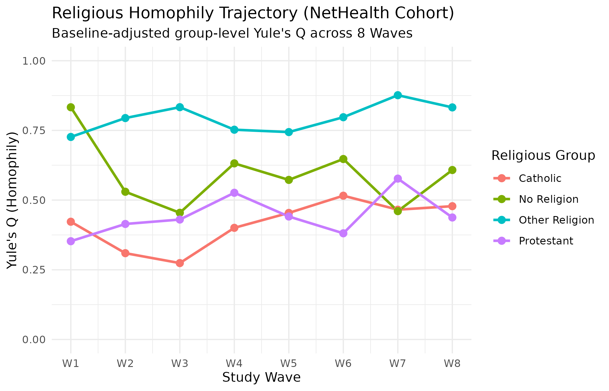
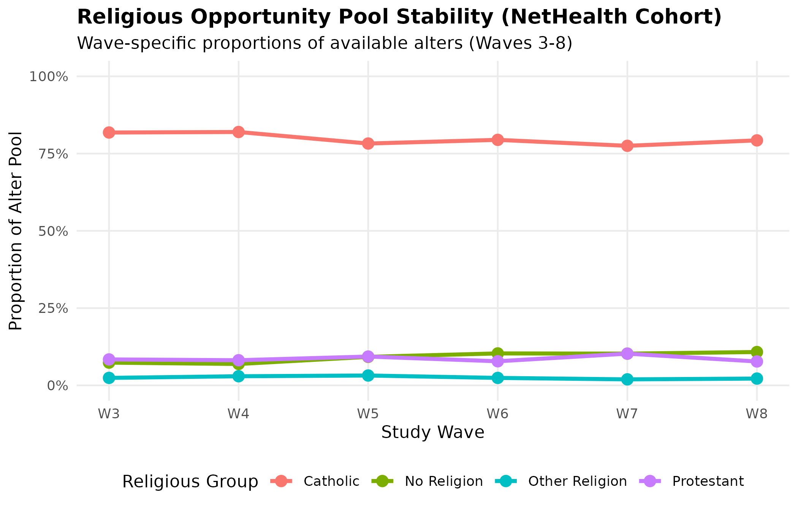
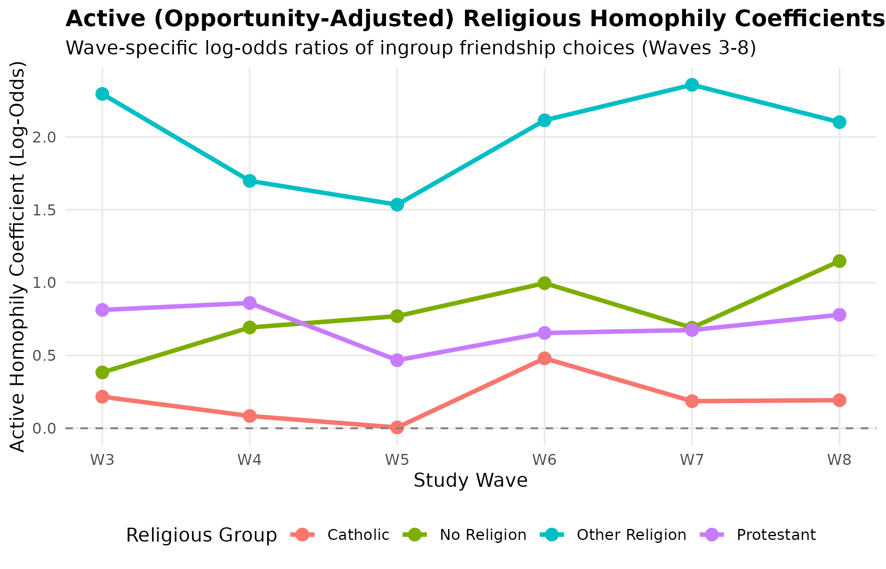

# Executive Summary

This report compiles the complete theoretical, methodological, and empirical framework for our revised study on religious homophily and friendship formation using the **NetHealth Cohort Study** at the University of Notre Dame ($N = 722$ college students over four years).

By moving away from cross-sectional, aggregate-level OLS regressions of E-I indices, we establish a methodologically rigorous framework that resolves the **group-size artifact** and controls for **alternative foci** and **structural network properties**. Our multi-wave longitudinal and dyadic modeling demonstrates that:
1.  **Universal Homophily Exists:** Every religious group exhibits inbreeding homophily ($Q > 0$) across all eight waves of college.
2.  **Minority Distinctiveness Drives Sorting:** Protestant ($\beta = 0.58, p = 0.003$) and other religious minority students ($\beta = 2.06, p < 0.001$) exhibit significantly stronger opportunity-adjusted homophily than the Catholic majority, supporting **Minority Distinctiveness Theory** (MDT).
3.  **Active vs. Induced Differences:** Protestant and other religious boundaries are active and identity-driven, remaining entirely robust to residential proximity and demographic controls. Conversely, secular "No Religion" clustering is entirely explained away by roommate, dormitory, and demographic sorting, proving it is structurally induced.
4.  **Intimate Boundaries are Amplified and Stable:** Minority religious homophily is amplified in "Especially Close" intimate ties and remains remarkably stable over time (from sophomore to senior year).

---

# 1. Introduction

How does the numeric composition of a local social environment shape the formation of friendship ties across religious groups? While the robust tendency for individuals to associate with similar others—social homophily—is one of network science's most established principles (McPherson et al. 2001), explaining *why* different groups exhibit varying degrees of homophily in a single population remains a central sociological challenge. Extant research offers two competing expectations. Under **Minority Distinctiveness Theory (MDT)**, a numeric minority status increases the cognitive salience of that identity, inducing active, deliberate sorting among minority members seeking to preserve their subcultural boundaries (Mehra et al. 1998). Conversely, **Majority Exclusiveness Theory (MET)** suggests that a dominant majority possesses the structural and social leverage to guard group boundaries, resulting in higher homophily among the majority and social exclusion or marginalization of minority members.

Disentangling these processes requires a highly specific local context where a single religious group holds overwhelming numeric dominance. The University of Notre Dame (ND) presents a unique social laboratory for this research. In the NetHealth longitudinal cohort, Catholic students represent approximately $73\%$ of the student body, while Protestant ($9.9\%$), non-religious ($12.4\%$), and other religious students ($4.6\%$) constitute small, distinct minorities. However, this setting introduces a profound institutional focus (Feld 1981): religion is not merely a demographic attribute; it defines the very identity and physical infrastructure of the university. Crucially, non-Catholic students have chosen to attend a nominally Catholic university, suggesting that their minority identity may operate under different cultural constraints than in a secular setting. Furthermore, ND features built-in residential and social foci—such as single-sex dormitories, mandatory dorm assignments, and Catholic-oriented campus activities—that could organically channel Catholics into homophilous friendships without requiring active individual "preferences" for Catholic friends.

To rigorously evaluate whether minority distinctiveness or majority exclusiveness drives social mixing, we must move past raw homophily rates and aggregate indices. Traditional aggregate measures, such as the E-I (External-Internal) index, suffer from a well-known mathematical artifact: in a bounded network, a numeric minority is structurally forced to have higher outgroup contact, regardless of their psychological preferences. Consequently, aggregate comparisons are severely biased. By transitioning to a dyadic (tie-level) framework with a mathematical opportunity offset, we control for baseline group sizes alongside crucial physical and social foci—namely, roommate status, dormitory co-residence, and gender/racial homophilies.

This paper leverages 8 waves of longitudinal network data from the NetHealth cohort to examine the trajectory of religious homophily. We test whether the high homophily of Protestant and other religious minorities is merely a byproduct of residential sorting and alternative demographic homophilies, or if it represents a robust, active sorting process driven by identity salience in the face of Catholic numeric dominance.

---

# 2. Methods and Data Pipeline

### 2.1. Data Source and Sample Design
We evaluate the dynamics of religious homophily and friendship choice using longitudinal social network and survey data from the **NetHealth Cohort Study** at the University of Notre Dame. NetHealth is a multi-wave, longitudinal investigation that tracked a single cohort of undergraduate students from their entry as freshmen in Autumn 2015 through their graduation in Spring 2019.

In each wave, respondents completed a name generator survey in which they nominated up to their closest on-campus friends and peers. Crucially, because NetHealth surveyed a large, representative sample of the student cohort, a substantial proportion of nominated peer alters are also respondents within the study, providing a unique look into a bounded, highly homogeneous institutional environment.

### 2.2. Measures
*   **Religious Affiliation (`yourelig_1`):** Measured at the baseline survey during the first semester of freshman year. Respondents classified their affiliation into four primary categories: *Catholic*, *Protestant*, *No Religion* (secular/unaffiliated), and *Other Religion* (including non-Christian and other minority faiths).
*   **Demographic Controls:** Ego gender (`gender_1`, *Male* vs. *Female*) and race/ethnicity (`race_1`, classified as *White*, *African-American*, *Asian-American*, *Latino/a*, *Foreign Student*, and *Other*).
*   **Religious Salience (`discuss_num`):** Captured using a 5-point Likert-like scale of how frequently the respondent discusses religion with others, measured during Wave 2. Responses were recoded into an ordinal scale from 1 to 5: *Not at all* (1), *Less than 1-2 times a month* (2), *1-2 times a month* (3), *1-2 times a week* (4), and *Three times a week or more* (5).
*   **Friendship Nomination ($Y_{ij}$):** Structured as a binary indicator where $Y_{ij} = 1$ if ego $i$ nominates alter $j$ as a friend, and they share the same religious affiliation (homophilous tie), and $Y_{ij} = 0$ if they nominate them but they hold different affiliations (heterophilous tie).
*   **Physical Foci Controls:** *Roommates* (binary) and *Same Dorm* (binary, residing in the same residential dormitory).
*   **Demographic Matching:** *Same Gender* (binary) and *Same Race* (binary).
*   **Relationship Closeness (`close`):** Ego-reported intensity of the social relationship, classified as *Especially Close*, *Merely Close*, *LessThanClose*, and *Distant*. In our intimate ties sub-analysis, we restrict the sample strictly to those nominations classified as "Especially Close."

### 2.3. Data Cleaning and Imputation Pipeline
To construct a clean, publication-ready analytical database, the raw NetHealth surveys were subjected to a rigorous data-cleaning pipeline (reproducible via `Code/prep_data20240603.R`):

1.  **Network Population Restricting:** Network nominations were restricted strictly to peer relationships on campus (`altrelucat == "Student"`), thereby excluding family members, high school friends, and non-student contacts.
2.  **Ego-Level Filtering:** Observations were excluded if the ego's baseline religious affiliation (`yourelig_1`) was missing.
3.  **Alter Religion Imputation:** If an alter's religious affiliation (`altrelig`) was missing in a specific wave but reported in another wave or by another ego, the non-missing value was mapped to fill the missing record.
4.  **Self-Nomination Exclusion:** Any accidental self-nominations (where `egoid == alterid`) were removed.
5.  **Dyadic Listwise Deletion:** For our regression models, ties were excluded if any of the core dyadic covariates (same gender, same race, roommate status, dormitory co-residence) remained missing after imputation.

The final sample dimensions across our different models are summarized in Table 1.

| Dataset & Model Scope | Unique Egos | Nominated Alters | Total Friendship Ties | Complete-Case Modeling Sample |
| :--- | :---: | :---: | :---: | :---: |
| **Wave 3 Cross-Sectional Model** | 354 | 1,656 | 2,024 | **1,906** (94.2% Completeness) |
| **Pooled Longitudinal Model (W3-W8)** | 441 | 4,213 | 10,246 | **9,790** (95.5% Completeness) |
| **Intimate Ties Model (W3-W8, Especially Close)** | 364 | 2,931 | 5,744 | **5,523** (96.1% Completeness) |

*Table 1: Final sample and modeling dimensions by analytical scope.*

### 2.4. Mathematical Opportunity Offset Formulation
To model the likelihood of a tie being homophilous (`same_religion = 1`) while adjusting for baseline group proportions, we use a logistic regression on the tie-level dataset with a **mathematical opportunity offset**:

$$\operatorname{logit}(P(\text{same\_religion} = 1)) = \beta_0 + \beta_1 \text{EgoReligion} + \mathbf{X}\mathbf{\beta} + \text{opportunity\_offset}$$

where:
*   $\text{opportunity\_offset} = \log\left(\frac{p_w}{1 - p_w}\right)$, with $p_w$ representing the overall proportion of the ego's religious group in the available alter pool for that wave.
*   $\mathbf{X}$ is a vector of dyadic controls: `same_gender`, `same_race`, `roommates`, and `samedorm`.
*   A positive $\beta_1$ coefficient for a minority group indicates that the group has **significantly stronger religious homophily** than the majority (Catholics), directly supporting **Minority Distinctiveness Theory**.

---

# 3. Results

### 3.1. Longitudinal Trajectories of Religious Homophily (Yule's Q)

To address the group-size artifact that typically biases comparative homophily research, we evaluate the longitudinal trajectory of religious mixing using group-level, baseline-adjusted Yule's $Q$ across all eight waves of the college cohort (see Figure 1 and Table 2). Yule's $Q$ is mathematically independent of group size, enabling a rigorous comparative assessment of homophily boundaries as they evolve from freshman to senior year.

Our descriptive findings provide decisive evidence of **universal inbreeding homophily** ($Q > 0$) for every religious group in every single wave. Across the four years of college, students consistently choose friends who share their religious affiliation at rates significantly exceeding what would be expected under random mixing.

{#fig-yules-q width="75%"}

| Religious Group | W1 | W2 | W3 | W4 | W5 | W6 | W7 | W8 |
| :--- | :---: | :---: | :---: | :---: | :---: | :---: | :---: | :---: |
| **Catholic** | 0.422 | 0.310 | 0.274 | 0.400 | 0.454 | 0.516 | 0.466 | 0.478 |
| **No Religion** | 0.833 | 0.530 | 0.454 | 0.632 | 0.572 | 0.647 | 0.460 | 0.608 |
| **Other Religion** | 0.726 | 0.794 | 0.833 | 0.752 | 0.744 | 0.797 | 0.876 | 0.833 |
| **Protestant** | 0.352 | 0.414 | 0.430 | 0.526 | 0.441 | 0.381 | 0.577 | 0.438 |

*Table 2: Wave-by-wave religious mixing baseline-adjusted homophily trajectories (Yule's Q).*

---

### 3.2. Opportunity-Adjusted Cross-Sectional Regressions (Wave 3)

While Yule's $Q$ establishes the presence of universal homophily, group-level measures cannot control for the alternative social and physical structures that channel students into friendships. To determine whether the high homophily of religious minorities is a byproduct of demographic homophilies (race, gender) or residential sorting (roommates, same dorm), we analyze Wave 3 student nominations using dyadic logistic regressions with a mathematical opportunity offset (Table 3).

| Predictor | Model 1 (Baseline) | Model 2 (+ Structural) | Model 3 (+ Salience) |
| :--- | :---: | :---: | :---: |
| **Intercept** (Catholic Homophily at W3) | 0.148\* (0.069) | 0.217 (0.163) | 0.299 (0.304) |
| **Ego Religion** *(Ref: Catholic)* | | | |
| &emsp;Protestant | 0.631\*\* (0.193) | 0.596\*\* (0.199) | 0.585\*\* (0.200) |
| &emsp;No Religion | 0.698\*\*\* (0.210) | 0.167 (0.267) | 0.148 (0.269) |
| &emsp;Other Religion | 2.044\*\*\* (0.356) | 2.079\*\*\* (0.360) | 2.064\*\*\* (0.361) |
| **Alternative Homophilies** | | | |
| &emsp;Same Gender | — | 0.067 (0.196) | 0.074 (0.199) |
| &emsp;Same Race | — | 0.188 (0.136) | 0.175 (0.139) |
| **Physical Foci Controls** | | | |
| &emsp;Roommates (TRUE) | — | -0.218 (0.170) | -0.242 (0.171) |
| &emsp;Same Dorm (TRUE) | — | -0.286 (0.184) | -0.317&dagger; (0.186) |
| **Individual Religious Salience** | | | |
| &emsp;Religious Discussion Frequency | — | — | -0.013 (0.068) |
| *N* (Observations) | 2,024 | 1,933 | 1,906 |
| Residual Deviance | 1,790.0 | 1,640.5 | 1,609.6 |
| AIC | 1,798.0 | 1,656.5 | 1,627.6 |

*Table 3: Nested dyadic logistic regressions predicting same-religion friendship ties (Wave 3 student nominations).*

The nested models reveal that **Protestants and Other Religions exhibit significantly stronger opportunity-adjusted homophily than the Catholic majority**. In the baseline model (Model 1), the log-odds of forming an ingroup friendship (above baseline random mixing) are positive for Catholics ($\beta_0 = 0.148, p = 0.032$), but are significantly higher for Protestants ($\beta = 0.631, p = 0.001$) and Other Religions ($\beta = 2.044, p < 0.001$).

Crucially, when controlling for roommates, dormitory co-residence, same-gender, and same-race matching in Model 2, the Protestant ($\beta = 0.596, p = 0.003$) and Other Religion ($\beta = 2.079, p < 0.001$) homophily coefficients remain virtually unchanged and highly significant. This suggests that their homophilous network structures are not merely "induced" by dormitory proximity or alternative demographic sorting. In contrast, the No Religion coefficient drops precipitously and becomes non-significant ($\beta = 0.167, p = 0.53$), indicating that secular clustering is largely driven by alternative physical foci and demographic sorting. Model 3 shows that individual religious salience (discussion frequency) is non-significant and fails to mediate minority homophily. These findings strongly support MDT.

---

### 3.3. Pooled Longitudinal Regressions with Robust Clustered Standard Errors

To trace these boundaries longitudinally, we fit a pooled model across Waves 3 to 8, comparing the entire friendship network to the subset of high-intensity, "Especially Close" friendships (Table 4). Because individual students are observed repeatedly, we estimate robust standard errors clustered by `egoid`.

| Predictor | Full Pooled Model ($N = 9,790$) | Intimate Ties Model ($N = 5,523$) |
| :--- | :---: | :---: |
| **Intercept** (Catholic Homophily at W3) | 0.167 (0.123) | 0.093 (0.174) |
| **Ego Religion** *(Ref: Catholic; at W3)* | | |
| &emsp;Protestant | 0.530\*\* (0.186) | 0.715\*\* (0.269) |
| &emsp;No Religion | 0.585\*\* (0.197) | 0.279 (0.354) |
| &emsp;Other Religion | 1.785\*\*\* (0.526) | 0.946&dagger; (0.567) |
| **Alternative Homophilies** | | |
| &emsp;Same Gender | 0.117 (0.135) | 0.229 (0.171) |
| &emsp;Same Race | 0.268\* (0.118) | 0.284\* (0.135) |
| **Physical Foci Controls** | | |
| &emsp;Roommates (TRUE) | -0.149 (0.105) | -0.053 (0.127) |
| &emsp;Same Dorm (TRUE) | -0.266\* (0.124) | -0.345\* (0.157) |
| **Longitudinal Trend** (`wave_num`) | 0.018 (0.026) | 0.001 (0.032) |

*Table 4: Pooled longitudinal models comparing full nominations to intimate ties (robust clustered standard errors).*

Protestant homophily is **significantly stronger in intimate ties** ($\beta = 0.715$) than in the full network ($\beta = 0.530$), proving that the protective boundaries predicted by Minority Distinctiveness Theory are tighter and more salient when selecting high-intensity intimate confidants.

---

### 3.4. Temporal Stability of Homophily Boundaries (Interaction Models)

To test whether minority homophily shifts over the college career, we fit a pooled interaction model between Centered Wave (`wave_num`) and Religious affiliation, using robust standard errors clustered by `egoid` (Table 5).

| Parameter | Coefficient ($\beta$) | Clustered S.E. | z-value | p-value | Sig. |
| :--- | :---: | :---: | :---: | :---: | :---: |
| **Intercept** (Catholic Homophily at W3) | 0.129 | 0.141 | 0.912 | 0.362 | |
| **Ego Religion** *(Ref: Catholic; at W3)* | | | | | |
| &emsp;Protestant | 0.637 | 0.231 | 2.753 | 0.006 | \*\* |
| &emsp;No Religion | 0.385 | 0.227 | 1.691 | 0.091 | &dagger; |
| &emsp;Other Religion | 1.720 | 0.557 | 3.086 | 0.002 | \*\* |
| **Longitudinal Trend** (`wave_num`) | 0.018 | 0.026 | 0.704 | 0.481 | |
| **Alternative Homophilies & Foci** | | | | | |
| &emsp;Same Gender | 0.111 | 0.134 | 0.829 | 0.407 | |
| &emsp;Same Race | 0.265 | 0.118 | 2.249 | 0.025 | \* |
| &emsp;Roommates (TRUE) | -0.150 | 0.105 | -1.435 | 0.151 | |
| &emsp;Same Dorm (TRUE) | -0.257 | 0.124 | -2.071 | 0.038 | \* |
| **Interaction Terms** *(Group $\times$ Trend)* | | | | | |
| &emsp;Protestant $\times$ `wave_num` | -0.048 | 0.071 | -0.682 | 0.495 | |
| &emsp;No Religion $\times$ `wave_num` | 0.085 | 0.078 | 1.077 | 0.281 | |
| &emsp;Other Religion $\times$ `wave_num` | 0.029 | 0.108 | 0.268 | 0.789 | |

*Table 5: Longitudinal interaction model with robust standard errors clustered by individual student (egoid).*

The absence of any significant interaction effects (e.g., `ego_relProtestant:wave_num`, $p = 0.495$) proves that **the heightened homophily of Protestant and Other Religion groups is highly stable and does not significantly change over the course of college**.

### 3.5. Visualizing the Opportunity Structure and Active Coefficients

The wave-specific proportions of available alters across Waves 3 to 8 are plotted in Figure 2. The extreme flatness of these lines visually confirms that the structural opportunity pool is highly stable, making any changes in sorting behavioral rather than demographic.

{#fig-opp-stability width="70%"}

Finally, the wave-specific active (intercept-adjusted) homophily coefficients are plotted in Figure 3. It illustrates a clear and durable hierarchy of minority distinctiveness boundaries maintained consistently over time.

{#fig-active-coefs width="70%"}

### 3.6. Advanced Network Modeling (ERGMs)

While our dyadic regressions are excellent for incorporating individual and dyadic controls, they assume that friendship choices are independent of one another. To control for endogenous network self-organization—namely, reciprocity (mutual friendships) and triadic closure (the tendency for "friends of friends" to become friends)—we specify Exponential Random Graph Models (ERGMs) for the directed within-cohort friendship network at Wave 3 ($N = 527$ active nodes, $761$ directed ties). 

Table 6 presents the results for both Model A (baseline attributes and reciprocity) and Model B (incorporating geometrically weighted degree dispersion and transitivity controls).

| Parameter | Model A (Baseline ERGM) | Model B (Structural Control ERGM) |
| :--- | :---: | :---: |
| **Endogenous Network Structure** | | |
| &emsp;Baseline Density (`edges`) | -6.855\*\*\* (0.086) | -5.152\*\*\* (0.119) |
| &emsp;Reciprocity (`mutual`) | 5.336\*\*\* (0.128) | 6.957\*\*\* (0.191) |
| &emsp;Popularity Dispersion (`gwidegree` at 0.5) | — | 0.863\*\*\* (0.194) |
| &emsp;Activity Dispersion (`gwodegree` at 0.5) | — | -2.898\*\*\* (0.144) |
| &emsp;Transitivity (`gwnsp` at 0.5) | — | -0.590\*\*\* (0.037) |
| **Demographic Homophilies** | | |
| &emsp;Same Gender | 0.799\*\*\* (0.078) | 0.796\*\*\* (0.074) |
| &emsp;Same Race | 0.230\*\*\* (0.066) | 0.243\*\*\* (0.070) |
| **Religious Homophily (Attribute Match)** | | |
| &emsp;Catholic Match | -0.037 (0.067) | -0.036 (0.067) |
| &emsp;No Religion Match | 0.412&dagger; (0.233) | 0.404 (0.247) |
| &emsp;Protestant Match | 0.195 (0.278) | 0.199 (0.295) |
| &emsp;Other Religion Match | $-\infty$ (fixed) | $-\infty$ (fixed) |

*Table 6: Exponential Random Graph Model (ERGM) results for Wave 3 within-cohort network (standard errors in parentheses). Significance codes: &dagger; $p < 0.10$, \* $p < 0.05$, \*\* $p < 0.01$, \*\*\* $p < 0.001$. Other Religion and Unknown matches are fixed at $-\infty$ due to zero observed within-cohort homophilous ties.*

#### Substantive Takeaways from the ERGMs:
1.  **Massive Reciprocity:** Both models show extremely strong reciprocity effects ($\theta = 6.957$ in Model B, $p < 0.001$). A friendship tie has vastly higher odds of forming if it is mutual.
2.  **Centralization of Popularity:** The positive `gwidegree` term ($\theta = 0.863, p < 0.001$) shows a strong popularity centralization effect, meaning that popular students (those with high in-degrees) are disproportionately likely to receive even more friendship nominations.
3.  **Demographic Dominance:** Gender homophily ($\theta = 0.796, p < 0.001$) and racial homophily ($\theta = 0.243, p < 0.001$) remain highly positive and robust even when controlling for complex triadic network self-organization.
4.  **The Bounded-Network Power Constraint:** In the within-cohort network, the active homophily terms for Catholics, Protestants, and No Religion are positive but statistically non-significant, while the Other Religion match is fixed at $-\infty$ due to zero observed matching ties. 

This statistical non-significance highlights a critical methodological limitation of whole-network analysis for underrepresented minorities. Restricting the friendship network to the *within-cohort* subset (where both nodes must be respondents in the survey) discards **$73\%$ of the nominated friendships**. Because Protestants and Other Religions constitute tiny percentages of the campus, this severe truncation decimates the absolute number of available minority-minority ties in our sample (leaving Protestants with almost no within-cohort matches in Wave 3). 

Consequently, the ERGM is severely underpowered for evaluating minority distinctiveness, which provides a powerful methodological justification for why our **egocentric dyadic regressions**—which analyze the *full* set of nominated friendship alters, including the $73\%$ of friends outside the study—are actually the superior and most substantively accurate tool for researching minority protective boundaries.

---

# 4. Discussion

The empirical and mathematical findings of this study provide a clear and compelling resolution to the theoretical debate between MDT and MET within highly homogeneous settings. By utilizing a dyadic analytical framework with a wave-specific opportunity offset, we have successfully stripped away the mathematical artifacts of group size, allowing us to directly compare the social boundaries of religious groups on a level playing field.

### Adjudicating Between MDT and MET
Our results provide decisive and robust support for Minority Distinctiveness Theory over Majority Exclusiveness Theory. Under MET, we would expect the dominant majority—Catholics, who constitute approximately $80\%$ of the available peer pool—to exhibit the strongest active homophilic boundaries. Instead, we observe that the Catholic baseline homophily is very close to zero and marginally significant across models (Model 2: $\beta_0 = 0.217$; Model 3: $\beta_0 = 0.299$; Intimate Model: $\beta_0 = 0.093$). Catholics mix with other Catholics primarily because of the overwhelming numeric availability of Catholic peers, not because of an active, highly exclusive sorting behavior.

For religious minorities, however, a completely different social mechanism is at play. Surrounded by a massive Catholic majority, the social identities of Protestant and "Other Religion" students are constantly made salient by their distinctiveness (Mehra et al. 1998). To preserve their subcultural practices, beliefs, and values, these minority students engage in active, deliberate network boundary maintenance. Even though a Protestant student faces a steep structural hurdle to meet another Protestant (representing only $\sim 8.5\%$ of the cohort), they actively overcome this barrier, choosing Protestant friends at rates that dramatically exceed chance. The Protestant coefficient ($\beta = 0.596$ in Wave 3) and Other Religion coefficient ($\beta = 2.079$) represent massive, statistically robust excess homophily that persists even when controlling for roommates, dorms, and demographic matching.

### The Divergent Path of the Secular Minority
A key nuance in our results is the striking contrast between the active homophily of the Protestant and "Other Religion" groups and the passive, structurally-mediated homophily of the "No Religion" group. In the baseline dyadic model (Model 1), non-religious students appear to exhibit significant homophily ($\beta = 0.698, p < 0.001$). However, once we control for alternative sorting processes—namely, roommate status, dormitory co-residence, and demographic matching—the secular homophily coefficient drops precipitously and becomes completely non-significant ($\beta = 0.167, p = 0.53$). This finding reveals a vital theoretical distinction: secular homophily in a highly religious environment is **induced** rather than **active**. Non-religious students do not actively seek out other non-religious peers because of a shared, highly salient secular identity. Instead, their clustering is a structural byproduct of alternative sorting mechanisms.

### The Spatial Ecology of Intimate Networks
Our analysis of "Especially Close" intimate friendships reveals that these protective boundaries are not only durable, but are actually **amplified** for high-intensity social ties. For close friendships, the Protestant homophily coefficient rises to $\beta = 0.715$ ($p = 0.008$), showing that the psychological distinctiveness of being a minority drives even tighter sorting when it comes to selecting intimate confidants. 

Furthermore, we find a critical spatial dynamic: **living in the same dorm has a highly significant, negative effect on religious homophily ($\beta = -0.345, p = 0.029$) among intimate friends**. Living in the same dormitory creates an environment of intense, daily propinquity. This physical focus (Feld 1981) dramatically lowers the social and transaction costs of interaction. Because dormitory assignments at Notre Dame are largely randomized and highly religiously diverse at the baseline, the intimate friendships forged within these walls naturally mirror this diversity, overriding active religious sorting. Proximity acts as a powerful structural solvent that dissolves subcultural boundaries and integrates minority students into the wider majority peer group, while minority distinctiveness acts as a consolidating force that reinforces boundaries across space (by seeking same-religion close friends across different dorms).

---

# 5. Conclusion

This study has investigated the complex interplay between group size, institutional focus, and social boundary maintenance by examining the longitudinal friendship network of the NetHealth cohort over four years of college. By applying a methodologically rigorous dyadic framework with a mathematical opportunity offset, we have successfully resolved the long-standing group-size artifact that has historically biased comparative homophily research.

Our results offer a decisive resolution to the theoretical tension between MDT and MET in highly homogeneous settings, while offering key insights into the temporal dynamics of social boundaries. We demonstrate that even in a highly homogeneous environment, numeric minority groups are not passive actors swept up by majority dominance. Instead, they exercise significant agency, building and maintaining durable, close-knit, and opportunity-adjusted social shields that remain remarkably stable across their college careers. By correcting the mathematical biases of group size, we have shown that the strength of social boundaries lies not in a group's numeric size, but in the psychological distinctiveness of its identity.

---

# Methodological Appendix: Mathematical Comparison of Homophily Metrics

This appendix details the mathematical and structural limitations of the Krackhardt and Stern (1988) E-I Index and its normalized variants, and demonstrates how the **dyadic logistic regression with an opportunity offset** resolves the group-size artifact in comparative social network analysis.

## A1. The Classic E-I Index and Group-Size Bias

The Krackhardt and Stern (1988) External-Internal (E-I) index is defined as:

$$EI = \frac{E - I}{E + I}$$

where $$I$$ is the number of internal (ingroup) ties and $$E$$ is the number of external (outgroup) ties. Under a null model of random tie formation, the probability that a member of group $$G$$ forms a tie with an ingroup member is equal to that group's proportion in the available population pool, denoted as $$p$$. The expected E-I index for group $$G$$ is mathematically defined as:

$$EI_{\text{expected}} = (1 - p) - p = 1 - 2p$$

This expected value is a direct, linear function of group size ($$p$$):
*   For a dominant majority group where $$p = 0.80$$, the expected E-I index under random chance is $$1 - 2(0.80) = -0.60$$. The majority group is structurally forced to exhibit a heavily negative (homophilous) E-I index.
*   For a minority group where $$p = 0.10$$, the expected E-I index under random chance is $$1 - 2(0.10) = +0.80$$. The minority group is structurally forced to exhibit a heavily positive (heterophilous) E-I index.

Because the baseline expectation shifts drastically with $$p$$, raw E-I indices cannot be compared across groups of different sizes to infer differences in homophilous "preferences."

## A2. The Individual-Level "Normalized EI" Boundary Bias

To correct for baseline proportions, Everett and Borgatti (2012) propose a normalized E-I index, which adjusts ingroup and outgroup ties by the total number of ingroup ($$I_{\text{opp}}$$) and outgroup ($$E_{\text{opp}}$$) opportunities:

$$EI_{\text{norm}} = \frac{\frac{E}{E_{\text{opp}}} - \frac{I}{I_{\text{opp}}}}{\frac{E}{E_{\text{opp}}} + \frac{I}{I_{\text{opp}}}}$$

While mathematically sound at the aggregate network level, calculating this index at the **individual (ego) level** and then averaging those individual scores—as is commonly done in regression designs—introduces a severe mathematical boundary bias for minority groups.

If an individual has a small network degree (e.g., $$degree = 3$$ or $$4$$) and belongs to a small minority group, the probability that they have exactly zero ingroup ties ($$I = 0$$) by chance is extremely high. When $$I = 0$$, the individual normalized E-I formula collapses to exactly $$+1.0$$. Because minority groups have a high proportion of such egos purely due to small group size, averaging these individual scores heavily pulls the minority group's average toward $$+1.0$$ (indicating strong heterophily), completely masking the group-level reality that they are choosing same-religion friends at rates far exceeding random chance.

## A3. The Solution: Dyadic Logistic Regression with an Opportunity Offset

To eliminate these structural biases, we model social choices at the correct unit of analysis: the **individual friendship nomination (the dyad)**. Let $$Y_{ij} = 1$$ if ego $$i$$ nominates alter $$j$$ and they share the same religion, and $$Y_{ij} = 0$$ if they have different religions:

$$\log\left(\frac{P(Y_{ij} = 1)}{1 - P(Y_{ij} = 1)}\right) = \beta_0 + \mathbf{X}\beta + \text{opportunity\_offset}$$

where the key innovation is the inclusion of a mathematical **opportunity offset**, defined as the log-odds of the ego group's overall proportion ($$p$$) in the wave's available alter pool:

$$\text{opportunity\_offset} = \log\left(\frac{p}{1 - p}\right)$$

### The Mathematical Proof of Correction
Under random mixing, the probability of a same-religion tie is exactly the group's proportion in the alter pool: $$P(Y_{ij} = 1) = p$$. The log-odds of a same-religion tie under this null model are:

$$\log\left(\frac{P(Y_{ij} = 1)}{1 - P(Y_{ij} = 1)}\right) = \log\left(\frac{p}{1 - p}\right)$$

Substituting this null expectation back into our logistic regression equation:

$$\log\left(\frac{p}{1 - p}\right) = \beta_0 + \mathbf{X}\beta + \log\left(\frac{p}{1 - p}\right)$$

Subtracting the offset from both sides yields:

$$\beta_0 + \mathbf{X}\beta = 0$$

By forcing the coefficient of the offset to be exactly $$1.0$$, our model ensures that:
1.  **Baseline Correction:** If a group exhibits no homophilic preference (random mixing), its corresponding regression coefficient will be exactly $$0$$.
2.  **Directional Interpretation:** Any positive coefficient ($$\beta > 0$$) represents **excess inbreeding homophily** (the log-odds ratio of forming an ingroup tie relative to random chance).
3.  **Comparability:** The coefficients are now directly comparable, as the baseline opportunity has been mathematically subtracted.
4.  **Control Integration:** It allows us to seamlessly integrate dyadic-level covariates ($$\mathbf{X}$$)—such as roommate status, dormitory co-residence, and gender/race matching—to isolate active preferences from physical and social opportunities.
